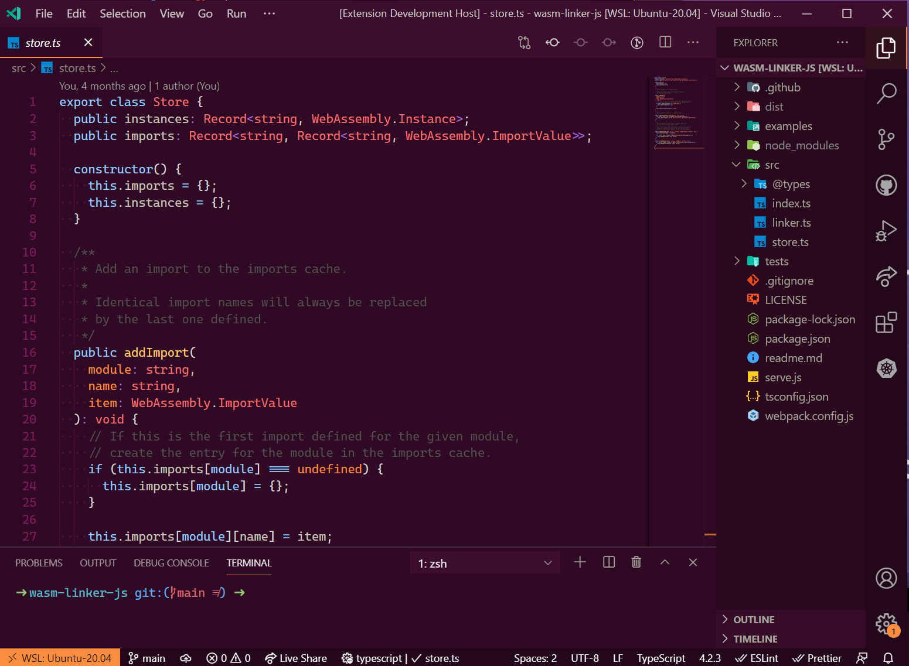
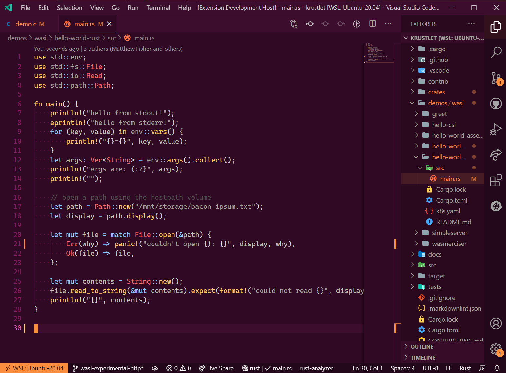
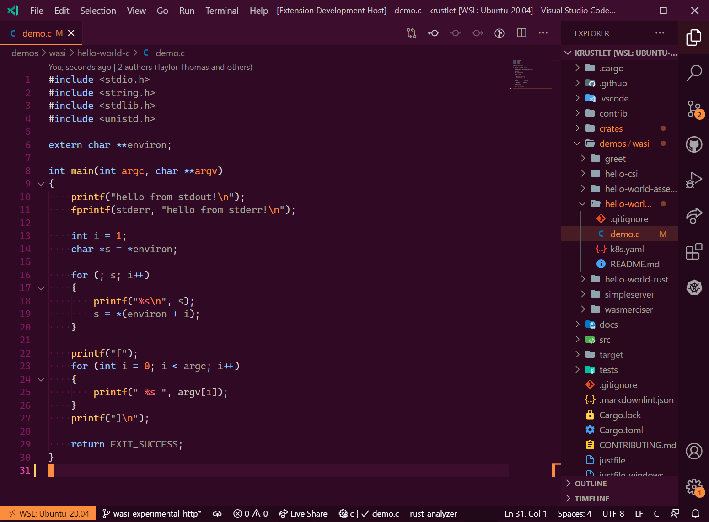

# Ubuntu color scheme for VS Code

> [Open this extension in the VS Code Marketplace][marketplace]

A color theme for VS Code, inspired by the Ubuntu terminal.

### Previews

- TypeScript:

- Rust:

- C:

### Notes

- the color scheme was initially generated using [the VS Code theme
  generator][theme-generator], and later manually tweaked by preference.
- this theme does _not_ follow any best practices around optimal contrast for
  color schemes.
- a similar color scheme for your Windows Terminal [can be found
  here][win-terminal-theme].
- a similar color scheme for iTerm2 [can be found here][iterm2-theme].

[win-terminal-theme]: https://windowsterminalthemes.dev/?theme=Ubuntu
[iterm2-theme]:
  https://github.com/mbadolato/iTerm2-Color-Schemes/blob/master/schemes/Ubuntu.itermcolors
[theme-generator]:
  https://marketplace.visualstudio.com/items?itemName=usernamehw.theme-generator
[marketplace]:
  https://marketplace.visualstudio.com/items?itemName=radu-matei.vscode-ubuntu-color-theme
